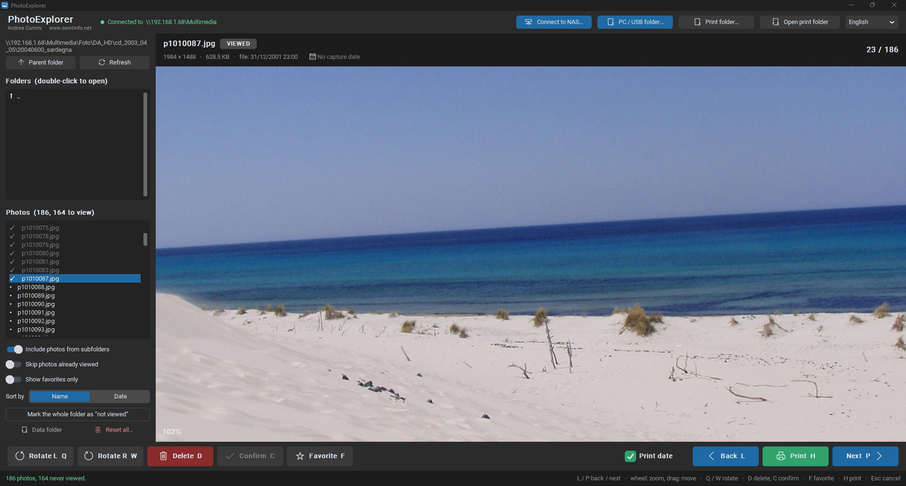

# PhotoExplorer

[English](README.md) · [Italiano](README.it.md) · [Español](README.es.md) · **Deutsch** · [Français](README.fr.md)

Fotobetrachter für NAS-Geräte (QNAP und ähnliche, über SMB) sowie für Ordner auf dem PC, auf
Festplatten und USB-Sticks, mit dunkler customtkinter-Oberfläche.
Gedacht zum Durchsehen großer Fotoarchive: Er merkt sich, welche Fotos bereits angesehen wurden,
und erlaubt es, sie zu drehen, zu löschen und zum Drucken in einen lokalen Ordner zu kopieren.

**Autor: Andrea Cumini — [www.osintinfo.net](https://www.osintinfo.net) — andrea@osintinfo.net**

> **Hinweis.** PhotoExplorer ist keine forensische Software. Ich habe es für den eigenen
> Gebrauch entwickelt, um meine privaten Fotos zu verwalten, und mich entschieden, es zu teilen.
> Es verändert Dateien (die Drehung schreibt das Foto neu, das Löschen entfernt es) und
> garantiert nicht die Integrität von Daten und Metadaten: Es darf nicht zur Sicherung, Analyse
> oder Aufbewahrung von Beweismitteln verwendet werden.



## Funktionen

- Verbindung zu einem freigegebenen SMB-Ordner (Benutzer und Passwort; das Passwort kann in der
  Windows-Anmeldeinformationsverwaltung gespeichert werden).
- Alternativ Fotos aus einem Ordner auf dem PC, einer externen Festplatte oder einem USB-Stick.
- Liste der Fotos des gewählten Ordners und aller seiner Unterordner.
- Merkt sich die bereits angesehenen Fotos, mit der Option „Bereits angesehene Fotos
  überspringen“ (bei lokalen Datenträgern an den Datenträger gebunden, nicht an den
  Laufwerksbuchstaben).
- Die Drehung wird in der Datei gespeichert (die EXIF-Daten bleiben erhalten).
- Löschen mit doppelter Bestätigung (auf lokalen Datenträgern kommt die Datei in den Papierkorb).
- Kopie in den Druckordner (das Original wird nie verschoben), auf Wunsch mit dem Aufnahmedatum
  in Rot unten rechts.
- Aufnahmedatum und GPS-Position aus den EXIF-Daten; ein Klick öffnet den Ort in Google Maps im
  Browser.
- Favoriten: mit einer Schaltfläche (oder der Taste F) markieren und allein anzeigen. Zum Druck
  gesendete Fotos werden automatisch zu Favoriten und sind in der Liste mit einem Symbol
  gekennzeichnet.
- Oberfläche auf Italienisch, Englisch, Spanisch, Deutsch und Französisch, in der oberen Leiste
  wählbar.
- Vollständiges Zurücksetzen der Daten (angesehene Fotos, Favoriten, Drucke) mit Bestätigung.
- Zoom mit dem Mausrad und Verschieben durch Ziehen.
- Formate: JPG, PNG, WEBP, TIFF, BMP, GIF und HEIC (mit `pillow-heif`).

## Tasten

| Taste | Aktion |
|---|---|
| P / L | nächstes / vorheriges Foto |
| W / Q | nach rechts / links drehen |
| D, dann C | löschen (D bereitet vor, C bestätigt; Esc bricht ab) |
| H | Foto in den Druckordner kopieren |
| F | Foto zu den Favoriten hinzufügen oder daraus entfernen |
| Mausrad / Ziehen | Zoom / vergrößertes Foto verschieben |

Jeder Befehl hat auch eine eigene Schaltfläche in der Oberfläche.

## Installation

Benötigt Python 3.11 oder neuer unter Windows.

```
python -m venv .venv
.venv\Scripts\python.exe -m pip install -r requirements.txt
.venv\Scripts\python.exe main.py
```

Eine einzelne ausführbare Datei (`dist\PhotoExplorer.exe`) mit PyInstaller erstellen:

```
.venv\Scripts\python.exe build.py
```

Einstellungen und die Liste der angesehenen Fotos werden in `%APPDATA%\PhotoExplorer`
gespeichert.

## Übersetzungen

Im Code stehen die Texte auf Italienisch in `tr("…")`; die anderen Sprachen befinden sich in
`photoexplorer/translations.py`. Um nach einer Änderung zu prüfen, dass nichts fehlt:

```
.venv\Scripts\python.exe tests\test_translations.py
```

Um eine Sprache hinzuzufügen, genügt es, ihren Code in `LANGUAGES` (`photoexplorer/i18n.py`) und
die zugehörigen Übersetzungen in `translations.py` einzutragen.

## Lizenz und Namensnennung

Copyright (C) 2026 Andrea Cumini. Freie Software unter der
[GNU GPL Version 3](LICENSE), mit den [Zusatzbedingungen](ADDITIONAL_TERMS.txt) nach
Abschnitt 7(b) der Lizenz. Ohne jede Gewährleistung.

In der Praxis: Sie dürfen das Programm verwenden, kopieren, verändern und weitergeben, aber jede
Kopie und jedes abgeleitete Werk muss

- unter der GPLv3 bleiben, mit verfügbarem Quellcode;
- die Namensnennung **Andrea Cumini — https://www.osintinfo.net — andrea@osintinfo.net** gut
  sichtbar beibehalten, in den Quelldateien und in der Oberfläche des Programms;
- deutlich angeben, dass es sich um eine veränderte Version handelt.

## Bibliotheken von Drittanbietern

Der Quellcode verwendet folgende Bibliotheken, ohne sie zu enthalten (jede unter ihrer eigenen
Lizenz): customtkinter (MIT), Pillow (MIT-CMU), smbprotocol und pyspnego (MIT), keyring (MIT),
pillow-heif (BSD-3-Clause).

Die Binärpakete von `pillow-heif` enthalten libheif und libde265 (LGPLv3) sowie x265 (GPLv2 oder
neuer), alles Lizenzen, die mit der GPLv3 dieses Programms vereinbar sind. Wer die ausführbare
Datei weitergibt, muss sie daher unter der GPLv3 weitergeben und den Quellcode verfügbar machen.

Die GPS-Position wird über eine gewöhnliche Google-Maps-Adresse im Browser des Benutzers
geöffnet: Das Programm lädt keine Karten herunter und bindet keine ein.
